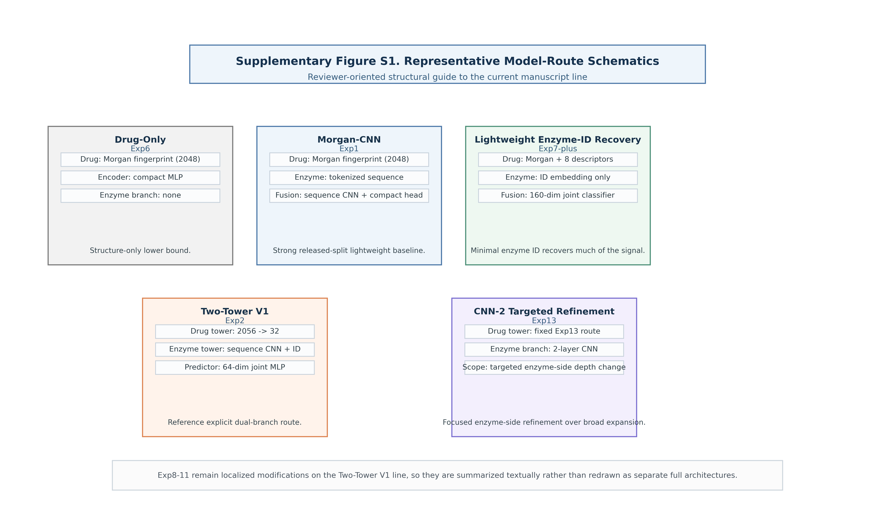

# Supplementary Information

## For Task-Aligned Complexity in Small-Sample Multi-Enzyme CYP450 Prediction

### Evidence from Lightweight Baselines and Scaffold Robustness

This Supporting Information accompanies the main manuscript and provides the auditable methodological and result record for the current CMDM manuscript line. It expands the main text with dataset-scope notes, active-file provenance, model specifications, training-protocol details, experiment-to-script mapping, full released-split and scaffold tables, and a reviewer-oriented structural schematic (`Figure S1`) that clarifies the representative model routes discussed in the study.

## Supplementary Note 1. Dataset and Preprocessing Details

### S1.1 Dataset Scope

All experiments in the manuscript are based on `05_Reproducibility_Materials/02_Data/cmdm_lab_cyp450_baseline_ready.csv`, the normalized analysis-ready benchmark table derived from the released `CMDM-Lab/CYP450` dataset [28]. In repository terms, this dataset corresponds to the public CMDM-Lab/CYP450 release distributed through the CMDM-Lab GitHub repository and its linked Figshare dataset record (`doi:10.6084/m9.figshare.26630515`). In the active workflow, this file is treated as the sole benchmark source for all reported tables and figures. It contains `15,005` drug-enzyme pairs spanning six major human CYP450 isoforms:

- `CYP1A2`
- `CYP2C9`
- `CYP2C19`
- `CYP2D6`
- `CYP2E1`
- `CYP3A4`

Each record represents a conditional drug-enzyme instance rather than a compound-only sample. This distinction is central to the manuscript because the same compound may appear under multiple enzyme contexts and may not share the same label across those contexts. In the released benchmark file, each row contains `enzyme_name`, `enzyme_seq`, `drug_name`, `drug_smiles`, `label`, and `split`, which makes the benchmark structure directly inspectable from the exported CSV. The unit of analysis throughout the manuscript is therefore the benchmark drug-enzyme pair, not an assay-normalized compound identity or a retrospectively harmonized literature record.

### S1.2 Task Definition

The prediction task is binary substrate classification. Given a drug representation and an enzyme representation, the model predicts whether the compound is a substrate of the specified CYP450 isoform. Within the released benchmark table, this decision is stored as a binary `label` field for each drug-enzyme pair. The main manuscript focuses on this conditional classification setting rather than on broader metabolic endpoints such as site-of-metabolism prediction or kinetic regression.

The benchmark release used in this study is sufficient for pair-level machine-learning evaluation, but the exported CSV does not preserve source-level assay annotations, evidence tags, or kinetic metadata. Accordingly, the manuscript interprets the task at the benchmark level and avoids finer claims about assay system, substrate threshold, or mechanism-specific pharmacokinetic behavior that cannot be recovered directly from the released table alone.

This constraint also affects label interpretation. In the present manuscript, positive and negative labels are used exactly as provided in the released benchmark table for supervised classification. Because the exported release does not expose assay-harmonized source metadata, a negative benchmark label is not interpreted here as universal evidence that a compound is a confirmed non-substrate across all possible assay conditions or literature sources.

### S1.3 Dataset Provenance and Active File Status

For the reported benchmark analysis, the active dataset is `05_Reproducibility_Materials/02_Data/cmdm_lab_cyp450_baseline_ready.csv`. This file is the sole active benchmark input used by the released-split and scaffold-split experiments reported in the manuscript, and no reported table or figure is generated from any alternative data file.

Within the submission package, the active provenance inputs are retained under `05_Reproducibility_Materials/02_Data/`, including `cmdm_lab_cyp450_root_canonical.csv`, `cmdm_lab_cyp450_baseline_ready.csv`, `cyp450_real.csv`, and the released source CSV files under `05_Reproducibility_Materials/02_Data/external_cmdm_root_csv/`. No reported table or figure in the present manuscript is generated from any alternative data file outside this packaged active bundle.

Historical project utilities indicate that the broader workflow once included separate stages for database collection, benchmark construction, and cleaning/validation. However, the current repository no longer retains the full upstream pipeline in executable form. For that reason, the manuscript deliberately limits provenance claims to what can be verified from the released CMDM benchmark table, the active analysis-ready CSV, and the active experiment scripts, rather than asserting a raw-source integration chain that cannot be fully reconstructed from the present repository alone.

The provenance statement in this study is therefore intentionally bounded. What is directly auditable from the repository is the released benchmark table, the normalized active analysis file, the reported experiment scripts, and the synchronized result artifacts. What is not fully auditable from the current repository snapshot is the entire upstream record-by-record evidence integration process that may have preceded the benchmark release. The manuscript is written to respect that distinction so that provenance claims remain scientifically defensible rather than aspirational.

### S1.4 Drug Representations

The main-line experiments draw from several drug-side representation families:

- `Morgan fingerprint (2048-dim)`, used as the dominant lightweight baseline representation
- `Morgan + 8 molecular descriptors (2056-dim)`, used in `Exp2`, Lightweight Enzyme-ID Recovery (`Exp7-plus`), and several Two-Tower variants
- `MACCS fingerprint (167-dim)`, used in `Exp10`

The eight molecular descriptors referenced in the main line are:

- `MolWt`
- `MolLogP`
- `NumHDonors`
- `NumHAcceptors`
- `TPSA`
- `NumRotatableBonds`
- `NumRings`
- `FractionCSP3`

Additional handcrafted descriptors used only in the heavier feature-engineering route (`Exp11`) include:

- `Balaban J-index`
- `Bertz complexity`
- fixed-count SMARTS pattern features

### S1.5 Enzyme Representations

The enzyme side of the benchmark is represented using one of three forms, depending on experiment family:

- no enzyme input, as in the Drug-Only lower-bound setting
- minimal enzyme identity encoding, as in Lightweight Enzyme-ID Recovery (`Exp7-plus`)
- amino-acid sequence-based encoders, typically implemented with embedding layers and 1D CNN modules

For sequence-based routes, enzyme sequences are converted to amino-acid token IDs and truncated or padded to a fixed maximum length of `512`. Enzyme identity is also represented explicitly where required, typically as a `6`-class index corresponding to the six CYP isoforms listed above.

### S1.6 Released-Split Protocol

The main performance line is built on the predefined released split stored in `05_Reproducibility_Materials/02_Data/cmdm_lab_cyp450_baseline_ready.csv`. In the reported released-split scripts, rows marked as `train` in the exported file are further shuffled with a fixed seed and split into training and validation subsets, while rows marked as `test` remain the held-out test subset. In the representative implementations, the validation subset is derived as `20%` of the shuffled training pool, and the fixed seed is `42`. The corresponding experiment records indicate the following subset sizes for the released-split setting:

- `Train: 10,344`
- `Validation: 2,585`
- `Test: 2,076`

These values are reused across the major baseline and engineering-variant experiments, which enables direct comparison across `Exp1`, `Exp2`, `Exp6`, Lightweight Enzyme-ID Recovery (`Exp7-plus`), `Exp8-11`, and `Exp13`. Because the split is defined at the benchmark-pair level rather than by unique compound identity, released-split performance should be read as performance under the benchmark's published protocol, not as a strict estimate of de novo drug generalization.

### S1.7 Scaffold Split Protocol

The scaffold robustness line is evaluated separately from the released-split line.

For `Exp12`, Murcko-scaffold sensitivity is evaluated across four scaffold ratios:

- `80/10/10`
- `70/15/15`
- `60/20/20`
- `50/25/25`

In the present manuscript, the scaffold benchmark compares six representative routes: `Drug-Only`, `Morgan-CNN`, Lightweight Enzyme-ID Recovery (`Exp7-plus`), `Two-Tower V1`, `Exp9`, and `CNN-2`. In the submission package, the corresponding script is `05_Reproducibility_Materials/01_Code/experiment12_CMDM_Scaffold_Robustness.py`, and the synchronized result artifact is `05_Reproducibility_Materials/03_Results/cmdm_experiment12_scaffold_robustness.json`.

The scaffold setting provides a stricter estimate of structural generalization by grouping molecules according to shared scaffold identity rather than allowing structurally similar compounds to be freely distributed across training and test subsets. Even so, scaffold split is still an internal benchmark protocol rather than an external prospective validation setting, so it should be interpreted as a stronger robustness stress test rather than as a full substitute for independent external evaluation.

### S1.7A Feasible Stronger Validation Layers Beyond the Current Manuscript

Within the current repository state, three stronger validation directions can be distinguished clearly.

First, a true temporal split is not currently auditable because the active released benchmark table does not retain record-level time metadata in a form that can support a defensible chronological partition. For that reason, the manuscript does not treat scaffold split as a proxy for time-based validation.

Second, a source-aware transfer split is only partially supported. The active table retains coarse source fields, which means that a source-stress protocol is conceivable in principle, but the exported release does not preserve sufficiently harmonized assay-level provenance to make source-wise negative-label interpretation robust across heterogeneous origins. Any future source-transfer analysis should therefore be treated as an additional robustness check rather than as assay-resolved truth.

Third, the most realistic next external-validation layer is cross-dataset transfer to a task-aligned public benchmark such as `CYPstrate` rather than further re-partitioning of the same CMDM release. Such an analysis would require explicit alignment of isoform coverage, SMILES normalization, and label semantics before model transfer or zero-shot comparison can be interpreted safely.

### S1.8 Why the Dataset Design Matters for the Main Argument

The dataset design helps explain why enzyme conditioning emerges as the main source of useful additional information. In a conditional drug-enzyme dataset, the same compound may be associated with different labels under different enzyme contexts. As a result, compound-only models are fundamentally limited: they can learn an average metabolism tendency but cannot fully resolve enzyme-specific substrate behavior. This is why the manuscript emphasizes the contrast among Drug-Only, descriptor-augmented Drug-Only, minimal enzyme-identity recovery, and richer enzyme-side encoders.

The same design also defines the interpretation boundary of the benchmark. Under the released split, the task should be read mainly as conditional classification on benchmark-like chemistry rather than as strict de novo compound prediction, because the same drug may still appear across subsets under different enzyme contexts. Scaffold split therefore serves as the manuscript's stricter chemical-generalization check.

## Supplementary Note 2. Full Model Specifications

### S2.1 Morgan-CNN Baseline (`Exp1`)

The Morgan-CNN baseline combines a compact drug encoder with a sequence-based enzyme encoder:

- drug input: `Morgan fingerprint (2048-dim)`
- drug encoder: `Linear(2048 -> 128) + ReLU + Dropout`
- enzyme input: amino-acid token sequence
- enzyme encoder: embedding layer followed by stacked 1D CNN and pooling blocks
- fusion: concatenation of drug and enzyme embeddings
- classifier: `256 -> 128 -> 1`

This route serves as the strongest lightweight baseline in the main manuscript.

### S2.2 Two-Tower V1 Baseline (`Exp2`)

The Two-Tower V1 baseline explicitly separates drug and enzyme representations:

- drug input: `Morgan(2048) + 8 descriptors = 2056-dim`
- drug tower: compact MLP ending in a `32-dim` representation
- enzyme input: tokenized sequence + enzyme ID
- enzyme tower: sequence CNN branch plus enzyme-ID embedding branch
- predictor: concatenated `64-dim` joint representation followed by a compact MLP head

This route functions as the reference Two-Tower baseline for `Exp8-11`.

### S2.3 Drug-Only Lower Bound (`Exp6`)

The Drug-Only lower-bound model removes all enzyme-side input:

- drug input: `Morgan fingerprint (2048-dim)`
- encoder/classifier: compact MLP
- no enzyme branch

This route defines the lower bound for conditional modeling without enzyme information.

### S2.4 Lightweight Enzyme-ID Recovery (`Exp7-plus`)

Lightweight Enzyme-ID Recovery (`Exp7-plus`) is designed to test whether minimal enzyme information is sufficient to recover most of the lost signal:

- drug input: `Morgan + 8 descriptors = 2056-dim`
- drug projection: `2056 -> 128`
- enzyme input: `enzyme_id`
- enzyme embedding: `Embedding(6, 32)`
- classifier input: concatenated `160-dim` vector

This route is intentionally simple and is used to separate the value of enzyme conditioning from the value of heavier enzyme encoders.

### S2.5 Engineering Variants (`Exp8-11`)

The engineering-variant family introduces localized changes on top of the Two-Tower baseline:

- `Exp8`: focal loss + drug-side channel attention
- `Exp9`: drug-side channel attention only
- `Exp10`: MACCS drug representation + CYP2E1 oversampling
- `Exp11`: expanded handcrafted features + enzyme-specific calibration parameters

These routes are grouped together because they test whether incremental engineering changes can systematically improve the standard Two-Tower line.

### S2.6 Enzyme-Side CNN Ablation (`Exp13`)

`Exp13` keeps the drug tower and predictor fixed while varying only the depth of the enzyme CNN:

- `Enzyme CNN-1`
- `Enzyme CNN-2`
- `Enzyme CNN-3`

This design makes `Exp13` the clearest targeted structure-ablation experiment in the benchmark.

### S2.7 Scaffold Robustness Benchmark (`Exp12`)

`Exp12` is the stricter generalization benchmark in the present manuscript. Rather than extending the model family list indefinitely, it re-evaluates a representative subset of routes under Murcko scaffold split:

- `Drug-Only`
- `Morgan-CNN`
- Lightweight Enzyme-ID Recovery (`Exp7-plus`)
- `Two-Tower V1`
- `Exp9`
- `CNN-2`

This design asks whether the released-split ranking survives a more structurally separated protocol. The main result is that scaffold robustness favors the stronger explicitly conditioned routes more than the released split does, with `CNN-2`, `Two-Tower V1`, and `Exp9` forming the scaffold-leading group by average `AUROC` across four scaffold ratios.

### S2.8 Shared Structural Theme Across the Manuscript

Although the experiments differ in detail, the manuscript organizes them into a shared structural logic:

- baseline routes ask what works with minimal complexity
- enzyme-side ablation asks where complexity can still be useful
- engineering-variant routes ask whether extra modules add stable value
- scaffold experiments test robustness under stricter structural generalization

## Supplementary Figure S1. Schematic Comparison of Representative Model Routes

Figure S1 provides a reviewer-oriented schematic summary of five representative routes in the current manuscript line: `Drug-Only`, `Morgan-CNN`, Lightweight Enzyme-ID Recovery (`Exp7-plus`), `Two-Tower V1`, and `CNN-2`. Its role is explanatory rather than quantitative. The figure is included to make clear where enzyme information enters each route, how the lightweight baseline differs from the explicit Two-Tower design, and how the targeted `CNN-2` refinement differs from broad architecture expansion.

The figure does not report performance values and should not be read as a separate ranking result. Instead, it functions as a structural guide to the model families already described in `S2.1-S2.7`. The heavier engineering variants (`Exp8-11`) are not redrawn as standalone full architectures in Figure S1 because, within the current manuscript logic, they are localized modifications layered onto the `Two-Tower V1` line rather than separate conceptual routes.

## Supplementary Note 3. Training Protocol

### S3.1 Common Optimization Settings

Most main-line experiments reuse a shared training recipe centered on:

- `EPOCHS = 50`
- `BATCH_SIZE = 64`
- `LR = 1e-3`
- `DROPOUT = 0.3`
- `SEED = 42`
- optimizer: `Adam`

This consistency is important because the manuscript's argument depends on comparability across experiment families rather than on individually optimized hyperparameter searches.

### S3.2 Loss Functions

The dominant loss function in the benchmark is `BCEWithLogitsLoss` with class weighting:

- `BCEWithLogitsLoss(pos_weight=...)`

This is used across the main baselines and most engineering variants. A focal-loss variant is introduced specifically in `Exp8` in order to test whether an ostensibly more class-sensitive loss function improves performance in a stable way.

### S3.3 Best-Checkpoint Selection

Across the main-line experiments, model selection is generally based on validation-set AUC:

- train for the fixed number of epochs
- monitor validation AUC
- retain the best-performing checkpoint
- evaluate the selected checkpoint on the test split

This protocol is consistent with the manuscript's focus on classification ranking quality as the primary decision metric.

### S3.4 Reproducibility Controls

The experiment records consistently emphasize:

- fixed random seed usage
- stable train/validation/test partitions within each protocol
- result-file logging in the synchronized reproducibility-bundle result directory `05_Reproducibility_Materials/03_Results/*.json`
- checkpoint saving in `05_Reproducibility_Materials/03_Results/checkpoints/*.pt`

The manuscript therefore relies on the reported experiment records rather than on retrospective manual aggregation from incompatible older summaries. To complement this deterministic workflow view, we also ran a compact three-seed repeat (`42`, `43`, and `44`) for the five released-split routes most relevant to the manuscript's central ranking: `Drug-Only`, `Morgan-CNN`, `Two-Tower V1`, `Exp7-plus`, and `CNN-2`. These repeated runs are summarized separately in Supplementary Table S2A and are used in the main text only to evaluate ranking stability rather than to replace the single-run released-split endpoints reported for the broader experiment line. Within the scope of the current CMDM release, this repeated-run layer and the scaffold benchmark together define the strongest fully auditable validation evidence; stronger external or temporal validation would require additional metadata alignment or cross-dataset harmonization beyond the current CMDM release.

### S3.5 Protocol Differences Across Experiment Families

Despite the broad consistency above, several experiment families deliberately diverge in a controlled way:

- `Exp8` changes the loss function to focal loss
- `Exp10` adds class- and isoform-specific resampling behavior
- `Exp12` changes the evaluation protocol from the released split to scaffold split across multiple ratios
- `Exp13` varies only the enzyme-side CNN depth while keeping the rest of the route fixed

These differences are not treated as nuisance variation; they are integral to the manuscript's evidence chain and are therefore described explicitly in both the main text and the supplementary document.

## Supplementary Table S1. Experiment-to-Script Mapping

Table S1 links each main-line experiment in the manuscript to its primary script and synchronized result file so that readers can trace the reported claims to the active implementation path used in the reproducibility bundle. All scripts cited in Table S1 are included directly in `05_Reproducibility_Materials/01_Code/` within this submission package.

| Main-Line ID | Primary Script | Main Result File | Main Output Type | Role in Manuscript |
|---|---|---|---|---|
| `Exp1` | `05_Reproducibility_Materials/01_Code/experiment1_CMDM_Morgan-CNN_baseline.py` | `05_Reproducibility_Materials/03_Results/cmdm_experiment1_morgancnn_result.json` | Released-split baseline result | Strong lightweight baseline |
| `Exp2` | `05_Reproducibility_Materials/01_Code/experiment2_CMDM_Two-Tower-V1_baseline.py` | `05_Reproducibility_Materials/03_Results/cmdm_experiment2_twotowerv1_result.json` | Released-split baseline result | Reference Two-Tower baseline |
| `Exp6` | `05_Reproducibility_Materials/01_Code/experiment6_CMDM_Drug-Only_baseline.py` | `05_Reproducibility_Materials/03_Results/cmdm_experiment6_drugonly_result.json` | Released-split lower-bound result | No-enzyme lower bound |
| `Exp7-plus` | `05_Reproducibility_Materials/01_Code/experiment7plus_CMDM_Lightweight_baseline.py` | `05_Reproducibility_Materials/03_Results/cmdm_experiment7plus_lightweight_result.json` | Released-split lightweight joint result | Lightweight Enzyme-ID Recovery |
| `Exp8` | `05_Reproducibility_Materials/01_Code/experiment8_CMDM_Two-Tower-V2_baseline.py` | `05_Reproducibility_Materials/03_Results/cmdm_experiment8_twotowerv2_result.json` | Released-split engineering variant | Focal loss + channel attention |
| `Exp9` | `05_Reproducibility_Materials/01_Code/experiment9_CMDM_Two-Tower-V3_baseline.py` | `05_Reproducibility_Materials/03_Results/cmdm_experiment9_twotowerv3_result.json` | Released-split engineering variant | Attention-only control |
| `Exp10` | `05_Reproducibility_Materials/01_Code/experiment10_CMDM_Two-Tower-V4_baseline.py` | `05_Reproducibility_Materials/03_Results/cmdm_experiment10_twotowerv4_result.json` | Released-split engineering variant | MACCS + oversampling |
| `Exp11` | `05_Reproducibility_Materials/01_Code/experiment11_CMDM_Two-Tower-V5_baseline.py` | `05_Reproducibility_Materials/03_Results/cmdm_experiment11_twotowerv5_result.json` | Released-split engineering variant | SMARTS/topology/calibration |
| `Exp12` | `05_Reproducibility_Materials/01_Code/experiment12_CMDM_Scaffold_Robustness.py` | `05_Reproducibility_Materials/03_Results/cmdm_experiment12_scaffold_robustness.json` | Multi-ratio scaffold-split result | Scaffold robustness benchmark |
| `Exp13` | `05_Reproducibility_Materials/01_Code/experiment13_CMDM_CNN_Ablation_baseline.py` | `05_Reproducibility_Materials/03_Results/cmdm_experiment13_cnn1_result.json`, `05_Reproducibility_Materials/03_Results/cmdm_experiment13_cnn2_result.json`, `05_Reproducibility_Materials/03_Results/cmdm_experiment13_cnn3_result.json` | Controlled ablation results | Enzyme-side depth ablation |

## Supplementary Table S2. Full Released-Split Results Across Main-Line Experiments

Table S2 reports the single-run released-split endpoint results for the full main-line experiment sequence. It serves as the detailed numerical companion to the higher-level main-text comparison in Tables 1-2 and helps show where stronger and weaker routes separate across AUROC, AUPRC, MCC, accuracy, and F1.

| Experiment / Route | Parameters | Best Val AUROC | Test AUROC | Test AUPRC | Test MCC | Test Accuracy | Test F1 | Notes |
|---|---:|---:|---:|---:|---:|---:|---:|---|
| Morgan-CNN (`Exp1`) | 1,412,481 | 0.9010 | 0.9253 | 0.7135 | 0.6020 | 0.8844 | 0.6712 | Strongest released-split baseline |
| Two-Tower V1 (`Exp2`) | 269,537 | 0.8680 | 0.9197 | 0.6881 | 0.5832 | 0.8560 | 0.6535 | Reference Two-Tower baseline |
| Drug-Only (`Exp6`) | 262,401 | 0.8230 | 0.8755 | 0.5554 | 0.5002 | 0.8136 | 0.5852 | No-enzyme lower bound |
| Lightweight Enzyme-ID Recovery (`Exp7-plus`) | 284,481 | 0.8934 | 0.9203 | 0.6986 | 0.5763 | 0.8593 | 0.6499 | Minimal enzyme-conditioning recovery |
| Two-Tower V2 (`Exp8`) | 273,729 | 0.8734 | 0.9181 | 0.6946 | 0.5547 | 0.8189 | 0.6202 | Focal loss + channel attention |
| Two-Tower V3 (`Exp9`) | 270,609 | 0.8758 | 0.9198 | 0.6812 | 0.5856 | 0.8560 | 0.6551 | Strongest engineering-branch endpoint |
| Two-Tower V4 (`Exp10`) | 148,641 | 0.8612 | 0.9109 | 0.6189 | 0.5652 | 0.8579 | 0.6416 | MACCS + CYP2E1 oversampling |
| Two-Tower V5 (`Exp11`) | 270,189 | 0.8843 | 0.9159 | 0.6652 | 0.5601 | 0.8473 | 0.6352 | SMARTS/topology/calibration variant |

## Supplementary Table S2A. Three-Seed Released-Split Stability Summary for Core Routes

Table S2A summarizes the compact three-seed repeat (`42`, `43`, `44`) for the five released-split routes most central to the manuscript's ranking interpretation. These repeated runs are included to evaluate ordering stability rather than to replace the broader single-run experiment line shown in Table S2.

| Route | Seeds | AUROC (mean +/- std) | AUPRC (mean +/- std) | MCC (mean +/- std) | Accuracy (mean +/- std) | F1 (mean +/- std) |
|---|---|---:|---:|---:|---:|---:|
| Drug-Only | 42, 43, 44 | 0.8773 +/- 0.0073 | 0.5697 +/- 0.0197 | 0.4931 +/- 0.0062 | 0.8231 +/- 0.0082 | 0.5825 +/- 0.0026 |
| Morgan-CNN | 42, 43, 44 | 0.9236 +/- 0.0025 | 0.7176 +/- 0.0111 | 0.6154 +/- 0.0215 | 0.8894 +/- 0.0104 | 0.6810 +/- 0.0156 |
| Two-Tower V1 | 42, 43, 44 | 0.9180 +/- 0.0036 | 0.6929 +/- 0.0074 | 0.5882 +/- 0.0232 | 0.8515 +/- 0.0249 | 0.6546 +/- 0.0248 |
| Lightweight Enzyme-ID Recovery (`Exp7-plus`) | 42, 43, 44 | 0.9181 +/- 0.0049 | 0.6997 +/- 0.0155 | 0.5819 +/- 0.0077 | 0.8687 +/- 0.0089 | 0.6548 +/- 0.0067 |
| Enzyme CNN-2 | 42, 43, 44 | 0.9178 +/- 0.0066 | 0.6819 +/- 0.0111 | 0.5672 +/- 0.0156 | 0.8359 +/- 0.0149 | 0.6352 +/- 0.0149 |

## Supplementary Table S3. Full Enzyme-Side CNN Ablation Results (`Exp13`)

Table S3 gives the full controlled ablation results for `Exp13`, where only enzyme-side CNN depth changes while the rest of the route is held fixed. This table supports the main-text interpretation that targeted refinement changes the metric trade-off without producing a monotonic overall gain.

| Variant | Parameters | Best Val AUROC | Test AUROC | Test AUPRC | Test MCC | Test Accuracy | Test F1 | Interpretation |
|---|---:|---:|---:|---:|---:|---:|---:|---|
| Enzyme CNN-1 | 269,793 | 0.8740 | 0.9186 | 0.7006 | 0.5477 | 0.8131 | 0.6135 | Shallow enzyme-side encoder |
| Enzyme CNN-2 | 508,129 | 0.8740 | 0.9165 | 0.7141 | 0.5738 | 0.8728 | 0.6489 | Best balanced ablation variant |
| Enzyme CNN-3 | 1,443,553 | 0.8735 | 0.9073 | 0.6742 | 0.5976 | 0.8690 | 0.6675 | Higher MCC, but weaker ranking metrics |

## Supplementary Table S4. Full Scaffold Robustness Results Across Four Ratios (`Exp12`)

Table S4 reports the full scaffold-split robustness panel across the four Murcko-scaffold ratios used in `Exp12`. It complements main-text Table 3 and Figure 3 by exposing the per-ratio AUROC and AUPRC values behind the scaffold-leading group interpretation.

| Model | Average AUROC Across Four Ratios | AUROC 80/10/10 | AUROC 70/15/15 | AUROC 60/20/20 | AUROC 50/25/25 | AUPRC 80/10/10 | AUPRC 70/15/15 | AUPRC 60/20/20 | AUPRC 50/25/25 |
|---|---:|---:|---:|---:|---:|---:|---:|---:|---:|
| Drug-Only | 0.7610 | 0.7837 | 0.7519 | 0.7596 | 0.7490 | 0.5157 | 0.4814 | 0.4782 | 0.4746 |
| Morgan-CNN | 0.7739 | 0.7792 | 0.7654 | 0.7758 | 0.7752 | 0.5514 | 0.5557 | 0.5611 | 0.5574 |
| Lightweight Enzyme-ID Recovery (`Exp7-plus`) | 0.7817 | 0.8023 | 0.7687 | 0.7783 | 0.7777 | 0.5386 | 0.5138 | 0.5150 | 0.5329 |
| Two-Tower V1 | 0.8070 | 0.8267 | 0.7995 | 0.8081 | 0.7937 | 0.5639 | 0.5537 | 0.5767 | 0.5430 |
| `Exp9` | 0.8054 | 0.8257 | 0.7987 | 0.7985 | 0.7987 | 0.5689 | 0.5568 | 0.5563 | 0.5690 |
| `CNN-2` | 0.8075 | 0.8214 | 0.8013 | 0.8081 | 0.7992 | 0.5762 | 0.5531 | 0.5865 | 0.5450 |

The first numeric column summarizes performance across four scaffold settings and should not be interpreted as a run-to-run uncertainty estimate.
